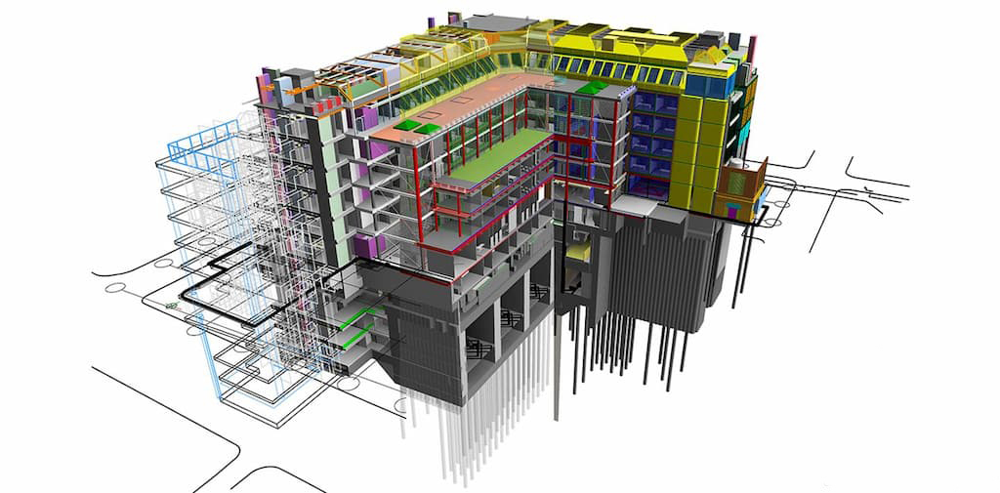

# BIM 3D Viewer with Speckle

## 🏗️ About BIM and Speckle

**BIM (Building Information Modeling)** là một quy trình số hóa toàn bộ thông tin trong vòng đời của một công trình xây dựng — từ thiết kế, thi công đến vận hành. Mô hình BIM không chỉ chứa hình học 3D mà còn bao gồm các thuộc tính chi tiết về vật liệu, chi phí, thời gian và kỹ thuật.

**Speckle** là một nền tảng mã nguồn mở cho việc chia sẻ dữ liệu mô hình BIM một cách dễ dàng, linh hoạt và có thể tùy chỉnh giữa nhiều phần mềm khác nhau (Revit, Rhino, AutoCAD, v.v.).

**Speckle Viewer** là một công cụ dựa trên web cho phép người dùng xem và tương tác với mô hình 3D được truyền tải qua Speckle ngay trên trình duyệt mà không cần cài đặt phần mềm CAD nào.

---

## 🔍 Features

- Hiển thị mô hình 3D BIM từ Speckle Stream.
- Hỗ trợ tương tác với mô hình: quay, xoay, phóng to/thu nhỏ.
- Lọc và xem thông tin chi tiết của từng đối tượng trong mô hình.
- Giao diện web thân thiện, dễ tích hợp vào các hệ thống quản lý công trình.

---

## 🚀 Technology Stack

- **Frontend**: ReactJS
- **3D Viewer**: Speckle Viewer SDK
- **Data Source**: Speckle Stream

---

## 📸 Demo



---

## 📦 Installation

```bash

cd fe
npm install
npm run dev
```
